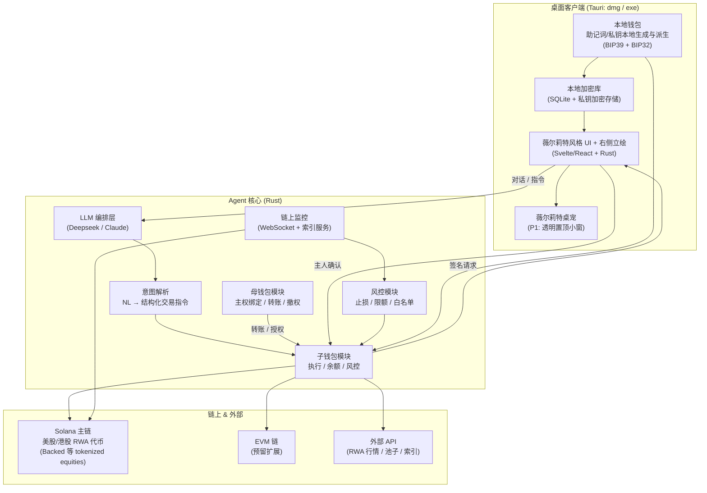

# Violet Agent — 技术架构

> 主链：**Solana** ｜ 标的：**美股 / 港股 RWA 代币（tokenized equities）** ｜ 形态：Tauri 桌面应用（dmg / exe）

## 架构总览



## 子母钱包（安全核心）

```
┌──────────────────────────────────────────────────────┐
│                   主人（你）                           │
│   母钱包 Mother Wallet  ←  资金主权，永远你掌控          │
│     ├─ 唯一主人绑定：初始化由母钱包签名识别、记住         │
│     ├─ 职能：给子钱包转账 / 授权与撤权 / 更换绑定         │
│     ├─ 特性：仅作控制与资金调度，不参与每笔交易签名       │
│     └─ 风险：始终离线级安全（可导入硬件/冷钱包）          │
├──────────────────────────────────────────────────────┤
│                   Violet Agent                        │
│   子钱包 Child Wallet  ←  执行钱包，100% 使用权          │
│     ├─ 唯一职责：持有主人转入的资金，执行交易             │
│     ├─ 授权：主人转账 = 自动获得该笔资金使用权的委托       │
│     ├─ 上限：AI / 黑客可动的最大范围 = 子钱包余额         │
│     └─ 风控：止损、限额、白名单都在这一层执行             │
└──────────────────────────────────────────────────────┘
```

- **主权绑定**：首次初始化由母钱包签名确认「主人身份」
- **更换母钱包**：旧母钱包签名发起 → 新母钱包签名确认，双签迁移
- **资金委托**：向子钱包转账 = 显式授权 100% 使用权
- **风险隔离**：子钱包被攻破的损失上限 = 子钱包余额；母钱包资产永远安全
- **可撤回**：随时终止子钱包权限、回收资金

## 模块职责

| 模块 | 职责 | 技术选型 |
|---|---|---|
| UI 层 | 对话、流水、持仓、止损面板、右侧立绘 | Tauri 2.x + Svelte / React |
| 桌宠 | 透明置顶小窗形象（P1） | Tauri 无边框透明窗口 |
| 本地钱包 | 助记词本地生成、派生、私钥加密 | BIP39 / BIP32 / argon2 / XChaCha20 |
| 母钱包模块 | 主权绑定、转账、撤权、更换绑定 | Solana Rust SDK / 多签预留 |
| 子钱包模块 | 执行交易、余额、风控边界 | Jupiter API / Hyperliquid SDK |
| LLM 编排 | 理解意图、决策辅助、对话 | Deepseek V4 / Claude（可插拔 Provider） |
| 意图解析 | 自然语言 → 结构化交易 JSON | 函数调用 / JSON 约束输出 |
| 风控 | 止损、滑点上限、单笔限额、白名单 | 本地规则 + 链上触发 |
| 监控 | 价格、仓位、链上事件订阅 | WebSocket + 轻量索引 |

## 技术栈选型

- **框架**：Tauri 2.x（体积 ~10MB、Rust 贴合栈、原生支持透明桌宠）＞ Electron（~150MB、重）
- **Agent**：Deepseek V4 Pro（默认）/ Claude（可插拔）
- **执行**：优先 Jupiter 聚合器自动路由到 RWA 池；必要时直连对应 DEX / AMM
- **行情**：RWA 代币锚定的真实美股/港股价格（外部行情 API），与链上价格对比做滑点/价差提示

## 目录结构对应

```
src-tauri/src/
├── wallet/    # 子母钱包（mother.rs / child.rs / keystore.rs）
├── agent/     # LLM 编排 + 意图解析（llm.rs / parser.rs / provider.rs）
├── risk/      # 风控（stop_loss.rs / limits.rs / whitelist.rs）
└── monitor/   # 链上监控（price.rs / position.rs）
src/ui/
├── components/  # 对话 / 流水 / 持仓 / 止损面板 / 立绘
├── assets/      # 薇尔莉特风格资源
└── styles/      # 紫罗兰主题
```
