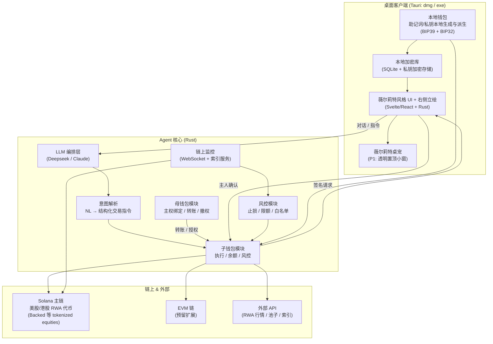

# Violet Agent — 链上交易 AI Agent 计划书

> **项目代号**：Violet Agent（ヴァイオレット，致敬《紫罗兰永恒花园》薇尔莉特·伊芙加登）
> **核心理念**：像薇尔莉特一样——冷静、精准、忠于指令，替你执行每一次决策，绝不自作主张。她是你「唯一受托的执行者」，但**资金主权永远在你手里**。

---

## 一、项目定位

一个**桌面端链上交易 AI Agent + 子母钱包管理系统**：母钱包由你（主人）掌控，子钱包是你转账给它、拥有 **100% 使用权**的执行钱包。**主链为 Solana**，主要交易标的对接**美股 / 港股的 RWA 代币（链上代币化股票）**。通过自然语言与 AI 对话，Violet Agent 在 Solana DEX / 流动性源上执行交易；全程**可视化**管理资产流水、持仓、止损/风控。发布形态为 **macOS（.dmg）+ Windows（.exe）** 桌面应用，并开源到 GitHub。

一句话：**「你说买什么，薇尔莉特用她的钱包去执行；你说止损，薇尔莉特盯着。而她花的每一分钱，都来自你给她的授权。」**

### 核心差异点（凭什么值得做、值得发 GitHub）
| 现有方案 | 痛点 | Violet Agent 的解法 |
|---|---|---|
| 终端 CLI Agent（链上 bot） | 无 UI、私钥暴露风险、难上手 | 可视化桌面端 + 子母钱包隔离 + 私钥本地加密 |
| 交易机器人（网格/套利） | 预设策略、不能对话、无 AI | 自然语言驱动 + AI 决策辅助 |
| 通用 ChatGPT Agent | 不能真实执行链上交易 | 打通钱包签名 + 多 DApp 执行 |
| 托管型交易钱包 | 私钥交给平台、资金主权让渡 | **子母钱包**：执行权与主权分离，主人永远掌控母钱包 |

---

## 二、功能规格（MVP → 完整版）

### P0 核心（第一版必须）
- **子母钱包架构**：母钱包（你掌控）+ 子钱包（100% 使用权给 Violet 执行）
- **母钱包唯一主人绑定**：初始化时识别并记住唯一母钱包，可自行更换
- **Solana + 美股/港股 RWA 交易**：子钱包签名在 Solana DEX 上交易**美股/港股 RWA 代币**（Swap / Limit / 仓位开平）
- **自然语言对话**：`买入 SOL 价值 500 USDC` / `给子钱包转账 1000 USDC` / `把 BTC 止损设在 60k`
- **钱包流水可视化**：实时交易记录、余额、盈亏曲线、资产分布、子母钱包往来
- **止损 / 风控**：AI 托管的条件单，价格触达自动提交链上订单（需用户预授权）
- **助记词本地生成**：BIP39 助记词本地生成，本地派生私钥，永不上云
- **薇尔莉特形象**：UI 右侧立绘形象（桌面宠物为 P1）
- **桌面应用**：dmg / exe，本地安全存储

### P1 进阶
- **薇尔莉特桌宠**：独立桌面宠物（透明无边框置顶小窗），随主程序存在
- 多链支持（EVM / BSC / Base…）
- 多 DApp 聚合（Jupiter、Raydium、Hyperliquid、Orca…）
- 持仓监控 + 移动端提醒（飞书 / Telegram / 邮件）
- 历史回测、策略模板库

### P2 探索
- 跨链意图（Intent）执行
- 多子钱包（按策略分账、限额隔离）
- 冷钱包多签、母钱包二次确认
- 社交化分享交易战绩

---

## 三、钱包架构（子母钱包）——本项目安全核心

```
┌──────────────────────────────────────────────────────┐
│                   主人（你）                           │
│   母钱包 Mother Wallet  ←  资金主权，永远你掌控          │
│     ├─ 唯一主人绑定：初始化由母钱包签名识别、记住         │
│     ├─ 职能：给子钱包转账 / 授权与撤权 / 更换绑定         │
│     ├─ 特性：仅作控制与资金调度，不参与每笔交易签名       │
│     └─ 风险：始终离线级安全（可导入硬件/冷钱包）          │
├──────────────────────────────────────────────────────┤
│                   Violet Agent                        │
│   子钱包 Child Wallet  ←  执行钱包，100% 使用权          │
│     ├─ 唯一职责：持有主人转入的资金，执行交易             │
│     ├─ 授权：主人转账 = 自动获得该笔资金使用权的委托       │
│     ├─ 上限：AI / 黑客可动的最大范围 = 子钱包余额         │
│     └─ 风控：止损、限额、白名单都在这一层执行             │
└──────────────────────────────────────────────────────┘
```

### 核心逻辑
1. **主权绑定**：首次初始化时，由你的母钱包签名确认「主人身份」，Violet 永久记住该母钱包为唯一主权者。
2. **更换母钱包**：旧母钱包签名发起 → 新母钱包签名确认，双签后完成迁移（本地留痕）。
3. **资金委托**：你把钱转入子钱包 = 显式授权 Violet 使用这笔资金执行交易（100% 使用权）。
4. **风险隔离**：子钱包即使被攻破，损失上限 = 子钱包余额；**母钱包资产与资金调度权永远安全**。
5. **可撤回**：你随时可终止子钱包权限、把剩余资金转回母钱包。

> **为什么这是最优解**：传统 Agent 要么交出全部私钥（风险大），要么每次交易都要你签名（烦）。子母钱包让 Violet 有自主执行空间，同时你保留绝对控制权——**执行权与主权分离**。

### 钱包兼容性
- **不绑定特定钱包软件**：核心要求只是「记住主人的唯一母钱包」。支持导入主流钱包（如 Phantom / Solflare / MetaMask 等的助记词或私钥，本地导入），或使用内置生成的钱包。
- 助记词/私钥**一律本地生成、本地加密存储**，仅由本地钱包组件使用。

---

## 四、技术架构



### 关键模块职责
| 模块 | 职责 | 技术选型 |
|---|---|---|
| **UI 层** | 对话、流水、持仓、止损面板、右侧立绘 | Tauri 2.x + Svelte（轻量）/ React |
| **桌宠** | 透明置顶小窗形象（P1） | Tauri 无边框透明窗口 |
| **本地钱包** | 助记词本地生成、派生、私钥加密 | BIP39 / BIP32 / argon2 / XChaCha20 |
| **母钱包模块** | 主权绑定、转账、撤权、更换绑定 | Solana Rust SDK / 多签预留 |
| **子钱包模块** | 执行交易、余额、风控边界 | Jupiter API / Hyperliquid SDK |
| **LLM 编排** | 理解意图、决策辅助、对话 | Deepseek V4 / Claude，可插拔 |
| **意图解析** | 自然语言 → 结构化交易 JSON | 函数调用 / JSON 约束输出 |
| **风控** | 止损、滑点上限、单笔限额、白名单 | 本地规则 + 链上触发 |
| **监控** | 价格、仓位、链上事件订阅 | WebSocket + 轻量索引 |

---

## 五、技术栈对比（选型依据）

### 框架：Tauri vs Electron
| 维度 | Tauri ✅（推荐） | Electron |
|---|---|---|
| 打包体积 | ~10MB | ~150MB+ |
| 内存占用 | 低 | 高 |
| 语言 | Rust（贴合你栈） | JS |
| 私钥/本地安全 | 更可控（Rust 内存管理） | 一般 |
| 桌宠（透明窗） | ✅ 原生支持 | 较重 |
| dmg/exe | ✅ | ✅ |

> **结论**：用 **Tauri 2.x + Rust**，与你的 Solana/Rust 基建完全统一，且原生支持透明置顶桌宠。

### Agent 层：Deepseek vs Claude（可插拔设计）
- **默认**：Deepseek V4 Pro（便宜、链上结构化指令强、你已熟）
- **可选**：Claude（复杂多步推理更强）
- 设计为 **Provider 抽象层**，一个接口换多家，方便发 GitHub 演示时用免费 API Key。

### 钱包层（子母钱包关键选型）
- 母钱包可对接主流钱包导入（Phantom / Solflare / MetaMask 助记词），或本地生成
- 子钱包优先内置生成 + 本地派生，保证 100% 使用权且不依赖第三方托管

### 执行层（RWA 标的对接）
- **交易标的**：美股/港股 RWA 代币（tokenized equities），如美股相对成熟的 Backed 类标的；港股供给较少
- **执行通道**：优先走 **Jupiter 聚合器**（自动路由到有流动性的 RWA 池），必要时直连对应 DEX / AMM
- **行情数据**：RWA 代币锚定的真实美股/港股价格（外部行情 API），与链上价格对比做滑点/套利提示

---

## 六、开发流程表（里程碑）

### M0 — 地基（Week 1）
- [ ] 项目脚手架（Tauri + Rust + 前端）
- [ ] 本地钱包：助记词本地生成 + 私钥加密存储
- [ ] 子母钱包模型：母钱包绑定 / 子钱包创建
- [ ] 钱包地址展示、只读余额

### M1 — 能对话（Week 2）
- [ ] LLM 接入 + 意图解析器
- [ ] 支持 `查看余额 / 查行情 / 给子钱包转账` 等只读/转账自然语言
- [ ] 对话 UI + 薇尔莉特右侧立绘初版

### M2 — 能交易（Week 3–4）
- [ ] Jupiter API / Solana RWA DEX 交易执行（子钱包签名，对接美股/港股代币）
- [ ] 母钱包转账 → 子钱包授权流程打通
- [ ] 交易记录 + 流水可视化（含子母往来）

### M3 — 能风控（Week 5）
- [ ] 止损 / 限价条件单
- [ ] 单笔限额 + 地址白名单 + 滑点保护
- [ ] 母钱包撤权 / 资金回收
- [ ] 价格监控与触达提醒

### M4 — 打磨发布（Week 6）
- [ ] 完整薇尔莉特视觉主题 + 桌宠（P1 提前并入）
- [ ] 打包 dmg / exe
- [ ] 开源仓库：README、架构图、安全白皮书、示例截图
- [ ] GitHub 发布（仓库创建 + 代码推送 + release）

---

## 七、安全设计（本项目第一优先级，绝不能省）

> 这是托管你真实资产的软件，安全是**上线前提**而非加分项。子母钱包本身就是安全设计的一环。

1. **私钥永不上云**：助记词**本地生成**（BIP39），私钥本地用 Argon2id 派生密钥 + XChaCha20 加密落盘；加密口令用户自设，绝不发送到任何服务器。
2. **子母钱包主权分离**：Violet 只持有子钱包执行权限，母钱包资金主权与调度权永远在你手里；子钱包即便被攻破，损失上限 = 子钱包余额。
3. **每笔交易可确认**：子钱包自动执行（100% 使用权），但母钱包级操作（大额转账、更换绑定、撤权）需主人签名确认。
4. **三层风控硬编码**：单笔限额、日累计限额、滑点上限，写死在本地，LLM 无权覆盖。
5. **RPC / API Key 最小权限**：只给只读或限额授权，签名用本地钱包而非托管 API。
6. **可审计日志**：每笔交易、每次授权/撤权全链路留痕，方便开源社区审计。
7. **开源透明**：代码开源，安全机制可被审查，而非黑箱。

---

## 八、风险与合规提醒

| 风险 | 说明 | 对策 |
|---|---|---|
| 子钱包泄露 | 执行钱包被攻破 | 损失上限 = 子钱包余额；母钱包主权隔离 + 可撤权回收 |
| 助记词泄露 | 最致命（母钱包） | 本地生成、本地加密、冷钱包导入选项、口令保护 |
| AI 误下单 | LLM 理解偏差 | 子钱包限额 + 可撤销 + 风控硬编码 |
| 链上无常损失/滑点 | 市场风险 | 滑点保护 + 止损 + 风险提示 UI |
| 合规（KYC/跨境） | 部分地区限制交易 bot | 明确「工具性」定位，非理财建议；文档声明非投资顾问 |
| 第三方 DApp 安全 | 合约风险 | 白名单 DApp + 只走成熟协议 |
| RWA 代币流动性/供给 | 美股代币较充足；港股代币供给少、流动性弱 | 首发聚焦美股 RWA，港股做 P1 验证后再开放 |
| 代币化合规 | 美股/港股代币化涉及证券监管 | 只交易公开合规的 RWA 标的，文档声明非投资顾问 |
| 角色形象版权 | 紫罗兰永恒花园为受版权保护角色 | 用**原创的「机械手写信使」风格化形象**致敬（紫罗兰色系 + 打字机/信纸），而非直接盗用官方立绘 |

---

## 九、命名与视觉（薇尔莉特主题）

### 配色与视觉语言
- **配色**：紫罗兰主色 `#8B5CF6` / 深紫 `#4C1D95` / 白底 `#FAFAFA`，点缀金色镶边
- **视觉语言**：细线、衬线标题、复古信纸质感、机械手写体点缀——呼应薇尔莉特「替人写信」的职业感
- **交互隐喻**：每笔交易像「一封委托信」，由薇尔莉特替你「送达并执行」
- **品牌徽标**：一朵紫罗兰 + 打字机/信纸元素

### 薇尔莉特形象（核心视觉资产）
- **主位**：UI 主界面右侧常驻薇尔莉特立绘形象，随状态变化（待命 / 受理委托 / 执行中 / 风险警告）
- **桌宠（P1）**：独立透明置顶小窗，桌面陪伴式存在；交易确认、风险触达时她会「开口」提醒
- **状态联动**：正常＝安静待命；交易执行中＝「受理你的委托」动画；触发止损＝警示表情
- **形象来源**：风格致敬而非盗用版权角色（见风险表），保证可商用开源

---

## 十、GitHub 开源与发布

### 发布执行流程（等你提供 GitHub API）
1. 你在环境变量提供 **GitHub Fine-grained PAT**（**建议：最小权限，仅单仓库、contents 写入**，用完可撤销）
2. 创建开源仓库 `violet-agent`（Public，含 MIT 或 Apache 2.0 许可）
3. 推送代码骨架（当前先从计划书 + 架构开始，后续逐里程碑推送）
4. 生成并发布首个 **Release**（附 dmg / exe 构建产物）

### 开源内容策略
1. **README 一图流**：架构图 + 产品截图 + 「3 分钟跑起来」
2. **提供测试网/小额安全默认**：默认只连 devnet / 小额 mainnet，降低开源用户风险
3. **安全白皮书 + 审计文档**：加分项，也是信任背书
4. **示例交易日志**：放几条真实流水截图，直观展示能力
5. **清晰的 CONTRIBUTING + 模块化目录**：降低贡献门槛，利于社区化

> **待你提供**：GitHub API token（Fine-grained PAT，限定单仓库 + contents:write 即可，避免给全账号权限）。给到后我就开始创建仓库并推送。

---

## 十一、待确认的关键决策

以下是我基于你背景的默认选择，请确认或调整，我再据此细化落地：

- [x] **主链**：已确认 **Solana**
- [ ] **RWA 标的与流动性源**：第一版对接哪些美股/港股 RWA 代币池（美股 Backed 类 / 港股标的）+ 走 Jupiter 聚合？
- [ ] **子钱包授权粒度**：转入即全权执行（默认）？还是按策略/用途分多个子钱包？
- [ ] **母钱包形态**：内置生成？还是支持导入 Phantom / Solflare / MetaMask？
- [ ] **LLM 默认**：Deepseek V4 Pro？
- [ ] **开源范围**：全开源？还是核心引擎闭源、只开源前端 + 文档？
- [ ] **薇尔莉特形象**：UI 右侧立绘（首发）+ 桌宠（P1）？还是桌宠提前并入？
